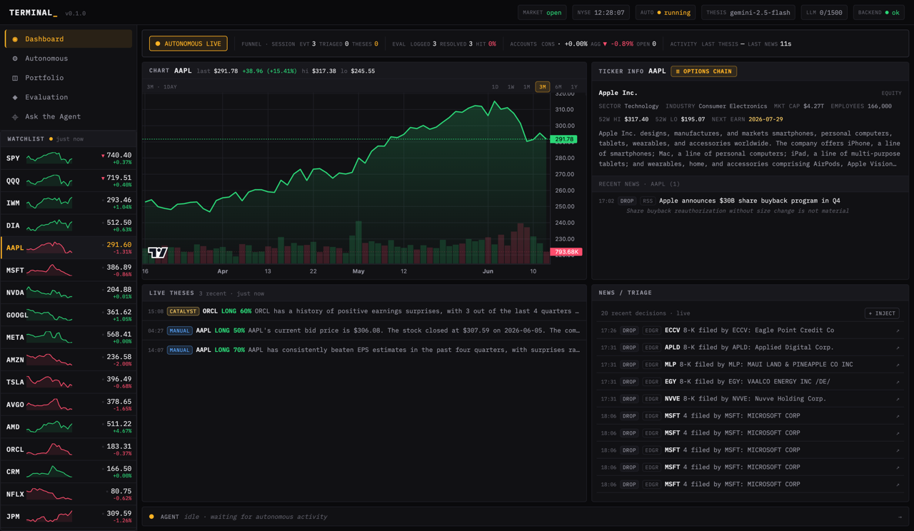
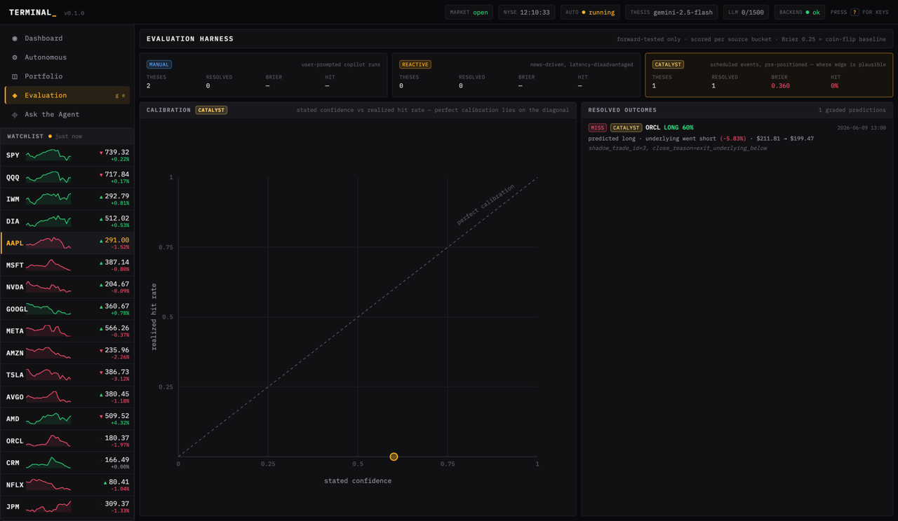
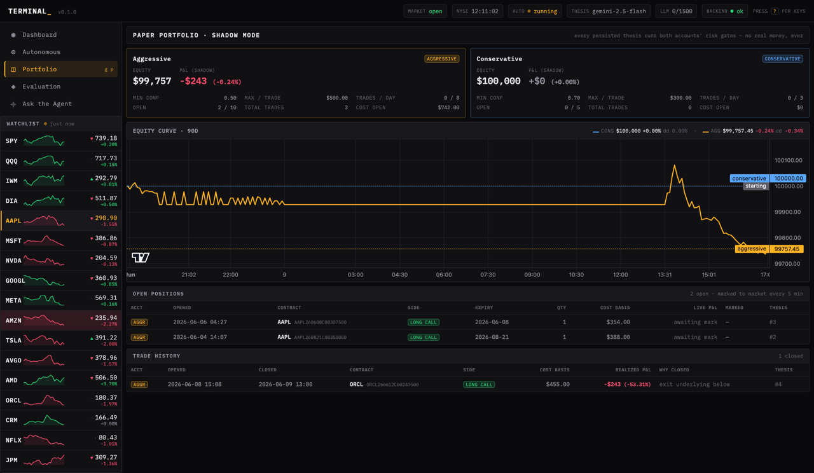
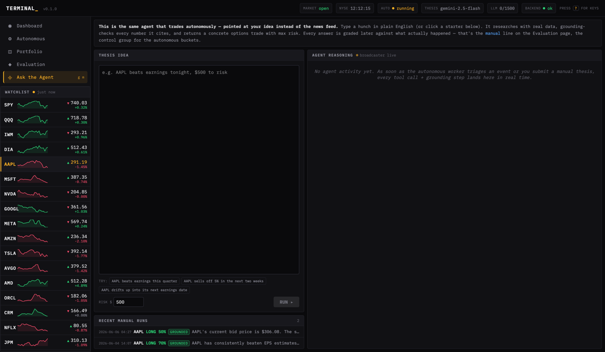
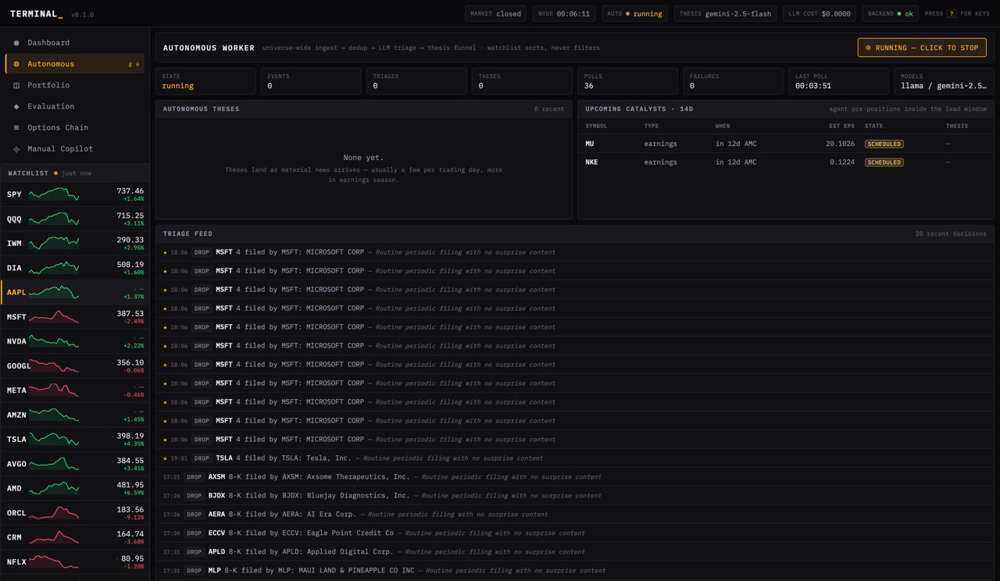

# Terminal

An AI-native trading research terminal that watches the entire US stock market all day. When something material happens — an 8-K filing, an earnings headline, a scheduled catalyst — a free-tier LLM reads it, researches the stock with real market data, and writes a structured options thesis (direction, contract, max risk, confidence). Deterministic risk rules decide whether it paper-trades. And then the part that makes the project honest: **every prediction is graded against what the market actually did.**

The project is measured by the **evaluation**, not the P&L.

> **Disclaimer.** This is a paper-trading research project. No real money is ever placed and no live order execution exists, by design. Nothing here is investment advice. All data sources are free tiers, which means delays and gaps; the system is built to degrade gracefully around them.



---

## How it works

```
news / filings / catalysts ─→ triage LLM ─→ thesis agent ─→ grounding check ─→ risk gates ─→ paper trade ─→ mark-to-market ─→ graded outcome
      (universe-wide)         (pass/drop)   (researches      (every cited      (no AI —        (simulated      (every 5 min)     (eval harness)
                                             with real        number verified   deterministic    fill)
                                             data tools)      against fetched   code)
                                                              data)
```

- **Ingestion** holds the long-lived connections: Alpaca's Benzinga news websocket (every article market-wide), an SEC EDGAR poller (every public filer), and a catalyst calendar of known upcoming events (earnings dates).
- **Triage** is a cheap LLM gate: "is this material?" ~95% of events drop here, which is what keeps the system inside free-tier quotas.
- **The thesis agent** is a tool-calling loop: it pulls price history, the options chain, fundamentals, and analyst data, then emits a typed, validated thesis object.
- **The grounding check** verifies every number the model cited against the data it actually fetched — born from a real incident where the model fabricated revenue figures and the system happily persisted them.
- **Risk and sizing are pure code.** The LLM's self-reported confidence never gates execution ([ADR-0003](docs/decisions/ADR-0003-deterministic-risk.md)). Two paper accounts run the same theses through different gates — conservative (≥0.70 confidence) vs aggressive (≥0.50) — an A/B test of whether LLM confidence carries any signal.
- **The eval harness** scores every thesis in three separate buckets — manual / reactive / catalyst — because they're different games ([ADR-0004](docs/decisions/ADR-0004-per-bucket-eval.md)): reactive trades fight a structural latency disadvantage; catalyst trades (pre-positioned before known events) are the one place edge is plausible. Hit rate, Brier score, and a calibration plot per bucket. Forward-tested only — backtesting an LLM is meaningless because the model has seen history in training.

Three processes (ingestion, agent worker, API server) meet only at PostgreSQL. Full design in [`docs/DESIGN.md`](docs/DESIGN.md); load-bearing decisions in [`docs/decisions/`](docs/decisions/).

## Being honest about edge

This system runs on free-tier data: news arrives in real time, but prices are 15-minute-delayed IEX quotes (~2% of consolidated volume). When news breaks, professional money has repriced the stock in milliseconds — so **reactive** trades are structurally late, and their returns should be near random. That's not a flaw discovered late; it's the design assumption ([DESIGN.md §2.6](docs/DESIGN.md)). The interesting question this project can legitimately answer is narrower and better: *given a fair game (scheduled catalysts, where everyone knows the timing), is an LLM's directional judgment calibrated — does 70% confidence win more often than 50%?* The calibration plot is the answer, and it only counts forward, on events the model hadn't seen.

---

## Status (2026-06-12)

```
✅ Phase 1   Foundation
✅ Phase 2   Data layer (Alpaca, EDGAR, Finnhub, FRED, yfinance) behind one resilient interface
✅ Phase 3   Pure-math UI (payoff diagrams, options chain)
✅ Phase 4   Manual copilot — "Ask the Agent" (tool-calling loop, grounding-checked)
✅ Phase 4.5 Strictness hardening + Groq provider
✅ Phase 5   Eval harness — per-bucket Brier + calibration plot
✅ Phase 6   Autonomous discovery (EDGAR + Alpaca news WS, universe-wide)
✅ Phase 7   Shadow paper trading (risk engine + MTM + outcome resolver)
✅ Phase 8   Bloomberg-style UI + SSE reasoning stream + live prices
✅ Phase 8.5 Design-system pass + product-shape pass (and the bug hunts described below)
⏳ Now       Continuous operation — accumulating forward-tested eval data
```

**293 backend tests + 25 frontend tests, all checks clean** (ruff, mypy, tsc, prettier; CI on every push). Five ADRs record the design calls.

## Roadmap (immediate)

1. **Run continuously** — on the dev Mac during market days now; moving to a spare home machine (Ubuntu Server + Docker + [Tailscale](https://tailscale.com) for private remote access) for true 24/7. Same `docker-compose.yml` either way; updates ship by `git push` → `git pull && docker compose up -d --build` on the box.
2. **Discord alerts** — phone ping when a thesis lands or a paper trade opens/closes ([plan](docs/step-9-plan.md)).
3. **Let the eval fill up** — the calibration plots earn their meaning with weeks of unsupervised theses.
4. **Demo recording** — 90-second walkthrough once the dashboard has real accumulated data.
5. Then the rest of [Step 9](docs/step-9-plan.md): persistent LLM usage log, Langfuse traces, replay mode, MCP server.

## The screens

| | |
|---|---|
|  |  |
| **Evaluation** — per-bucket Brier/hit cards, the calibration plot (perfect calibration = the diagonal), and every graded prediction with what actually happened | **Portfolio** — the conservative-vs-aggressive equity curves, open positions with live marks, and closed-trade history with realized P&L |
|  |  |
| **Ask the Agent** — the same engine pointed at your own idea, with the tool-calling loop streaming live | **Autonomous** — worker status, theses, the catalyst calendar, and the triage feed |

Plus an options-chain deep-dive modal (opens from the Ticker Info pane — the raw market the agent picks contracts from, with click-through payoff diagrams). Design language: IBM Plex Mono everywhere; amber = UI state, green/red = market direction only, blue/amber = the two accounts. Evolution for the curious: [pre-redesign](docs/screenshots/baseline-2026-06-11/dashboard.png) → [current](docs/screenshots/redesign-2026-06-12/dashboard.png), and the early days: [grid v3](docs/screenshots/grid-v3-polished.png), [post-chassis](docs/screenshots/grid-v2-features.png), [first Tailwind](docs/screenshots/grid-v1-empty.png).

## What I learned

Short, first-person notes added as phases land. The bits that were non-obvious.

**Dockerizing for 24/7 — the docs describe the design, `lsof` describes reality.** The task was "run the stack continuously via docker-compose," and the handoff said Postgres + Redis came from `docker compose up postgres redis`. Five minutes of `docker ps` / `lsof` / `ps` said otherwise: **zero containers running**, the stack was entirely native, and ports 8000/5173/5432/6379 were held by *other projects* — the backend on 8000 was a different app's `main:app` (which is why `/autonomous/status` 404'd; it was never mine), 5173 was octave's Vite, and the Postgres on 5432 was one shared instance holding three databases (`papersearch`, `scribur_db`, `terminal`). The approved plan said "stop the native services" — following it literally would have killed octave and taken down a Postgres two other projects depend on. So the cutover became: back up the `terminal` DB first (always), give Terminal its own self-contained Docker stack on **remapped host ports** via a gitignored `docker-compose.override.yml` (touching nothing else), and migrate the eval data into Terminal's own volume with `pg_dump` → restore. Two smaller traps along the way: Compose *concatenates* list fields like `ports`, so an override needs the `!override` tag or it re-exposes the conflicting base port; and the frontend on a new port (5174) hit CORS until I let development accept any-localhost-port via `allow_origin_regex`. I proved durability two ways — `restart` (data identical, worker auto-resumed) **and** `down`+`up` (containers destroyed and recreated, volume survived) — because only the second one actually models a reboot. **The lesson:** a handoff doc records what was *designed*, not what is *running*; before you act on "the database comes from X," spend the five minutes to confirm X is actually serving it — especially before any command that stops or deletes shared infrastructure.

**Moving the repo — an absolute path is a bet that nothing ever moves.** I moved the project from `Code/Projects/Terminal` to `Work/Projects/Terminal` and went hunting for what the move would break. The venv was the obvious casualty — every console script in `.venv/bin` hardcodes the interpreter path in its shebang, so a moved venv silently points `pytest`/`uvicorn` at a path that no longer exists (`uv sync` rebuilds it cleanly). The subtler one was a one-shot migration script that defaulted `SOURCE_URL` to the *full old absolute path* to a SQLite file — dead code by now, but a landmine: the next reader would have copy-pasted a path that resolves to nothing. The fix wasn't to swap in the new absolute path (that just rots again on the next move) — it was to derive it from `Path(__file__).resolve().parent.parent`, so the default tracks the script wherever the repo lives. A full-tree grep for both the old root and the old prefix (binaries included, so `.pyc` and caches count) is the only way to know you got all of it. **The lesson:** a hardcoded absolute path is a silent assumption that the machine layout is frozen forever; prefer paths derived from `__file__` or env, and when you must move a tree, grep for the old root across *everything*, not just the source you remember writing.

**Discord alerts — fire-and-forget is a *contract*, not a convenience.** Wiring phone alerts at the three moments that matter (thesis lands, paper trade opens, paper trade closes). The five lines of plumbing were trivial; the hard part was protecting the funnel from the webhook. A Discord 503, a DNS hiccup, a malformed embed — any of them, in a naive `await`, kills the run that produced the thesis I'm trying to alert about. So delivery lives behind two layers: `send()` catches every exception class (`httpx.ConnectError`, `httpx.TimeoutException`, `Exception` — yes, the bare one) and returns a bool; `fire_and_forget()` schedules `send()` on the running loop, then attaches a done-callback that *retrieves* the would-be exception so asyncio doesn't log a noisy `Task exception was never retrieved`. The test that earns its keep isn't "POST returns 204 → success" — it's "POST raises ConnectError → funnel returns normally". Drove the resilience contract into a parametrized matrix: 4xx, 5xx, connect error, no-webhook-configured, sync-context (no loop) — every one is a non-raising no-op. The embed builders also surfaced a small bug I'd have shipped: my negative P&L rendered as `$-100.00` because I composed `${pnl:,.2f}` after sticking the sign into a separate variable; the test that asserted `-$100.00` caught it, and the fix was `abs(pnl)` with the sign in front of the `$`. **The lesson:** "this is fire-and-forget" is not a description — it's a promise to the rest of the system. If you don't write the test that proves a 503 webhook can't kill the producer, you don't have fire-and-forget; you have a deferred bug.

**The silent reconnect storm — counters are only observability if someone reads them.** The user asked "why is all my news just SEC filings?" — and the answer was that the Alpaca news websocket had failed its handshake **10,382 times in a row** while the dashboard showed everything green. Two compounding bugs: Alpaca's data sockets greet every connection with `{"T":"success","msg":"connected"}` *before* answering auth, and my handshake read exactly one message — so it always saw the greeting, never the confirmation, and gave up; then the reconnect loop reset its backoff on every "successful" TCP connect, so a handshake bug became a 4-second hammer instead of a capped one-a-minute retry. The instrumentation to catch this existed the whole time (`news_stream_connected`, `news_stream_connects` — sitting in the status endpoint, rendered nowhere). **Three lessons: protocol handshakes are loops, not request/response pairs — read until you see your answer or a deadline passes; only a *fully established* session should reset reconnect backoff; and a health counter that no surface renders and no alert watches is a diary, not monitoring.** The fix is regression-tested with a scripted fake websocket that replays the real greeting sequence.

**The product-shape pass — every screen must serve the story, and one bug lives in N places.** Honest user feedback ("why is the options chain even there?", "I can't tell what trades happened") exposed that I'd been organizing the UI by *capability* instead of by *story*. The autonomous agent is the product; so the chain became a deep-dive modal off the ticker pane instead of a nav destination, "Manual Copilot" became "Ask the Agent" with one sentence explaining it's the control group for the eval buckets, the cost chip became `calls/daily-budget` (on free tier the scarce thing is quota, not dollars), and the portfolio page now answers the only two questions anyone asks a portfolio: what's open right now, and how did closed trades go. The nastier lesson: the one-sided-quote bug I'd fixed in the chain endpoint also lived in the MTM job and the outcome resolver — and there it had silently *closed two positions on a Sunday* against a phantom half-price and graded both theses as -50% misses. Contaminated eval data in the project whose whole claim is honest evaluation. The fix was to give `Quote` one `safe_price()` method and make every consumer use it, then surgically repair the record (backup → delete the provably-false grades → let the resolver re-grade against real prices), keeping the legitimate ORCL loss untouched. **Two generalizable rules: when you fix a bug at one call site, grep for the pattern before declaring victory; and "no usable data" must propagate as None — a pipeline that guesses prices will eventually trade, mark, and grade on fiction.**

**Design-system pass — semantic color, and what drawing data teaches you.** Coming back after a week away, the strongest fresh-eyes finding wasn't a bug — it was that one green (`#00ff88`) meant four different things: "price up", "long", "active nav", and "system live". The eye couldn't use color as information because color wasn't information. The fix was a semantic split: amber for UI state (selection, live indicators, identity), green/red strictly for market direction, blue/amber for the two paper accounts — plus one `palette.ts` mirroring the Tailwind tokens so canvas charts and SVG stay in sync with CSS. The second finding: half the frontend had been rebuilt in Tailwind while the four deep-dive pages still rode on 1,458 lines of legacy CSS — two design languages in one app, and the README described polish (cost chip, keyboard shortcuts) that a later refactor had silently dropped. Docs drift toward flattering the past; screenshots don't. **And the kicker: making the UI honest exposed two real backend bugs.** The chain page's new ATM highlight made it obvious the "spot" was exactly half the bid — a one-sided after-hours quote averaged against ask=0 — and the portfolio page's new account cards (+0.00%) sat right next to an equity curve reading -0.32%, because `equity_usd` was written once at seed time and never recomputed. Both had been wrong for weeks behind text-only views. Drawing data is a verification tool, not decoration: a number can be stale quietly; a picture of two disagreeing numbers can't.

**Phase 1 — Foundation.** The temptation was to wire a single LLM provider and "make it pluggable later." I forced the dual-stub setup (Gemini + Claude Haiku behind a `LLMProvider` Protocol) from day 1 instead. When Groq became sensible for triage and Gemini's free-tier RPM got tight later, swapping was a one-line config change — not a refactor. The cost of the abstraction upfront was trivial; the cost of retrofitting it would have been every caller.

**Phase 2 — Data resilience.** Every free-tier API has a different failure mode: 429s, silent breakage, format drift. I collapsed them behind one composition (cache → circuit breaker → rate limit → fetch with retry) as a `BaseProvider`. Every new provider just calls `_fetch_cached(key, ttl, fn)`; the agent funnel sees only `ProviderUnavailable` with a typed reason. The point isn't the libraries I avoided (tenacity, pybreaker) — it's that adding the next source now feels boring, which is what you want from infrastructure.

**Phase 4 — Manual copilot.** Schema validation is not correctness validation. The model can return schema-valid JSON that's still hallucinated. I ended up with three layers: schemas validate *shape*, the orchestrator validates *provenance* (the contract must come from a chain I actually fetched; the cost must fit the budget), and the grounding check verifies *numbers* in the reasoning trace back to tool output. Three different concerns, three different layers — collapsing them tempts the worst kind of bug.

**Phase 4.5 — The GOOG hallucination.** The most useful bug I've shipped. The model committed a thesis with a 2024 expiration, fabricated revenue figures, and a cost 11× the user's budget — and my code happily persisted it. Three failures compounded: `emit_final_thesis` ran before any data tool was called, the grounding-fail path didn't reject, and the schema had no validator against past dates or over-budget math. The fix wasn't "trust the model less" (not actionable) — it was deterministic preconditions: ≥2 data tool calls before commit, OCC symbol must be in a chain I fetched, max_risk ≤ budget, hard-reject on grounding fail with exactly one retry. **The lesson generalizes: LLM output is an input to your trusted code, not a substitute for it.**

**Phase 5 (partial) — Per-bucket scoring.** I almost computed a single Brier score across all theses. Catalyst-driven (scheduled, pre-positioned), reactive (news-driven, latency-disadvantaged), and manual-copilot theses are three different distributions; averaging them hides whether the model has edge anywhere specific. The dashboard scores three buckets separately. Calibration *per bucket* is what tells you something — a single number tells you nothing.

**Phase 6 — Discovery pipeline.** The instinct was to reach for Redis Streams immediately. I built an `InMemoryEventBus` behind the same Protocol; the Redis swap is a one-class change and ~130 events/day doesn't justify Kafka yet. Harder than the bus itself was bootstrap mode: on cold start, learn every filing that *already* exists, mark them seen, then publish only fresh events. Without it, the first poll fires hundreds of theses on ancient news. Cold-start handling is usually the unglamorous half of an "always-on" pipeline.

**Phase 7 — Shadow trades, deterministic risk.** The risk engine has zero LLM in it. Inputs: thesis + account config + live state; output: approved/rejected + sizing + a `risk_reason` string written inline on every shadow trade row. The conservative/aggressive contrast isn't decoration — it's the experiment on whether stated confidence translates to a sizing edge. Same thesis, different gates, different outcomes, all auditable from one column in the DB. The split between LLM (creative; produces theses) and code (deterministic; decides whether they trade) is the single most important boundary in the system.

**Post-Phase-7 hardening pass.** Did a fresh-eyes audit of everything 1–7 and found the kind of drift that accumulates when you ship phases fast: config defaults that didn't match the docs, hardcoded values in `seed.py` even though `config.py` already had the unused settings, a private `_interval` attribute reached through encapsulation, in-memory dedup state that would silently swallow filings on restart, and the pre-strictness GOOG hallucination row mixed into the same scoring pool as honest theses. None of these were bugs in isolation; together they were "the code drifting away from its own stated principles." Fixed in one batch: 8 new config entries replace hardcodes, `EdgarPoller.poll_interval` is now public, dedup lives in a `seen_discovery_events` table backfilled from `grounding_check_passed = FALSE`, the `pre_strictness` column lets the API exclude the GOOG row from dashboards while keeping it as evidence. **The lesson generalizes: a DESIGN.md / design doc is only load-bearing if you periodically diff the code against it and treat mismatches as bugs.**

**Closing the eval loop.** Built the MTM job, the OutcomeResolver, and the per-bucket eval dashboard with the calibration plot — the pieces that turn shadow trades from "opinions in a database" into a forward-tested track record. The key design call was separating *trade* P&L (closed-state on `ShadowTrade` + `PositionMark` history) from *thesis* outcome (`ThesisOutcome.realized_direction`): a long call can lose money even when the underlying moves up (theta, IV crush), and conflating those would punish the thesis for the trade structure rather than the prediction. The eval dashboard refuses to render zeros when N=0 — it returns nulls and a copy line explaining "no resolved outcomes yet; outcomes populate at expiration." The temptation to backfill with synthetic outcomes was real (the calibration plot looks more impressive with data), but the project's whole resume thesis is that the eval is forward-tested; faking outcomes would undermine the only thing the project actually claims. The first real calibration data will trickle in at expiration — months from now — and that's the honest version of the story.

**Universe-wide ingestion + the watchlist's real job.** The autonomous mode had silently drifted into a "watches 8 stocks" toy because the EDGAR poller was looping a watchlist of tickers — convenient for testing, wrong for the design. Added an Alpaca news WebSocket source (subscribed with the wildcard `*`, ~130 articles/day) and switched the EDGAR poller to the latest-filings atom feed (universe-wide across every public filer). Both publish into the same `DiscoveryEvent` shape on the same bus; the triage gate is what decides materiality, not the input pipe. **The harder lesson was about what the watchlist is *for*.** I had quietly let it become a filter because filters are easy to write; the right answer is that it's UI prioritization. The fix was small (sort watchlist symbols first, mark them with a star) but the conceptual cleanup is what made the autonomous mode honest: the agent sees the market, the user sees their own picks first. A WS source + a polling source sharing a Protocol/event shape made adding the second one boring — exactly the test of whether the Phase 6 abstraction was right.

**Catalyst calendar — the bucket where edge is plausibly measurable.** Reactive theses fire on news *after* it arrives, against a free-tier 15-min data delay — a latency disadvantage that makes a measurable directional edge unlikely. Catalyst theses fire on KNOWN events (earnings, later Fed/FDA) *before* the event, which removes the latency problem entirely. That's why DESIGN.md §8 demands per-bucket scoring: averaging the two would hide whether the model has edge in the path where it could. Built the `CalendarFetcher` (idempotent upserts of upcoming earnings via Finnhub, refreshes consensus EPS on the way) and the `CatalystScheduler` (triggers theses within a configurable lead window, transitions rows scheduled → triggered → expired). The interesting design choice was making "already triggered" a query-level filter, not a runtime check: the scheduler's `SELECT WHERE thesis_id IS NULL` is the dedup. **The lesson:** the right place to enforce "fire once" is in the row's state, not in code that runs every tick. State machines beat sentinel-checking loops every time.

**Bloomberg-level polish — the difference between "works" and "looks like a product."** The chassis worked. Five major features were wired (SSE, injector, live prices, equity curve, cost). The system passed every test. And the screenshot still read as "a hobby dashboard," because every pane was honest but generic — symbols + numbers, no sparklines, no day-change context, no freshness signal, no chart stats overlay, no equity reference line, no keyboard affordance. The polish pass touched every pane: a hand-rolled SVG `Sparkline` component on each watchlist row paired with a daily change %; a `/bars/batch/series` endpoint so the watchlist can fetch all symbols' history in one round trip; chart pane gets a top-aligned timeframe selector (1M / 3M / 6M / 1Y) with a stats overlay (last / change / hi / lo) in the pane subtitle; news/triage rows show `HH:MM` timestamps and four-letter source badges; equity curve gets a dashed starting-balance reference line, a max-drawdown stat per account, and a colour-keyed legend in its own header; bottom strip gets a weighted hit rate across buckets, separators, account arrows; a `KeyboardShortcuts` component reading `?` for the overlay, `/` to focus the copilot, and `g <letter>` to open deep-dive modals — with a `PRESS ?` hint in the header so people know. **The lesson:** "polish" feels cosmetic, but it's actually about hierarchy. The polished version doesn't have more data than the unpolished one — it has the same data, organised so the eye knows where to land. A sparkline + a daily-change-% next to a price tells you in one glance what a number alone makes you compute. A chart with a stats line above it tells you the story before you read the curve. The Bloomberg aesthetic is functional: it's information-density paired with hierarchy so you don't have to think.

**Streaming the agent's thinking — SSE end-to-end.** The manual copilot used to be a 15-to-45-second blank wait followed by a result blob. That's the most demo-hostile shape an AI feature can have — interviewers and reviewers see "thing that returned JSON," not "thing that thinks." Added `CopilotEvent` as a typed Literal union, threaded an optional `event_sink` callback through `Copilot.generate`, and wired a `/copilot/thesis/stream` SSE endpoint that drains an `asyncio.Queue` between the runner task and the response generator. The blocking endpoint stays, identical wire format, so existing callers (tests, future automation) don't move. Frontend uses `fetch + ReadableStream` (not EventSource — POST), parses the SSE wire format manually, and a `ReasoningContext` decouples the two panes: `CopilotInputPane` kicks off the run, `AgentReasoningPane` renders the events live. **The lesson:** the orchestrator should be observable, not just functional. Threading an event sink through a long-running async loop is a tiny architectural change that turns the same code into the demo *and* the unit-test fixture *and* the Langfuse hook. One affordance, three audiences.

**Synthetic event injector — populating the eval before reality does.** The autonomous funnel is gated on real news arriving. Real news arrives slowly, and the eval harness only learns from theses that actually flow through. To demo, to develop, and to test that the funnel works without waiting for a real 8-K, added `POST /autonomous/inject` that builds a `DiscoveryEvent` and pushes it onto the in-memory bus. The frontend's News/Triage pane grew a compact inject form with three preset headlines (earnings beat, 8-K, analyst upgrade). **The lesson:** a synthetic-event injector isn't a "test affordance" — it's the same demo loop the user will see, but with the timing under your control. The trick is that the injected event uses the same `DiscoveryEvent` envelope as every other source, so it travels through dedup, triage, and the thesis funnel exactly the way real news does. Nothing in the funnel knows it's synthetic.

**Live(ish) prices without WebSockets — SSE-proxied polling.** Real-time-feeling watchlist prices in a Bloomberg-style sidebar. Direct Alpaca WS integration would be plumbing for a free tier that's 15-minute-delayed anyway; instead, `GET /prices/stream?symbols=...` polls `get_latest_quote` every 5 seconds and emits one SSE event per symbol per tick. Frontend uses `EventSource` (GET is fine here) and keeps a per-symbol "previous mid" so it can render up/down ticks. **The lesson:** the demo asset is "the watchlist looks alive," not "we have a websocket." 5-second SSE polling is indistinguishable to the eye and an order of magnitude less plumbing — no WS auth, no reconnect logic, no subscribe-message protocol. Pick the tech for the perceived effect, not for the spec-sheet bullet point.

**Equity curve — the conservative-vs-aggressive A/B made legible.** The whole experimental claim of the project is "we test whether stated confidence translates to a sizing edge by running the same theses through different gates." Two account cards with a single P&L number do not communicate that. Added `/portfolio/accounts/{kind}/equity-curve` that re-derives the equity series from `PositionMark` + closed `ShadowTrade` rows on every request (no precomputed table — the data is sparse enough that the math is cheaper than the cache invalidation would be), and an `EquityCurveChart` component that draws both accounts as overlaid lightweight-charts lines. **The lesson:** the moment a project has a hypothesis, that hypothesis needs a chart. A number can be argued with; a curve can be pointed at.

**Cost telemetry — instrumenting the free tier.** Free-tier Gemini Flash means the real bill is $0.00, so the dollar number isn't the point — the point is "I track what would have cost what." Built a process-scoped `CostTracker` singleton with model pricing constants per `app/llm/cost.py`, wired `record()` calls at every Gemini and Groq return site, exposed `/llm/cost-summary`, and rendered the result as a chip in the header. Resets on restart; durable persistence is out of scope at this stage (DESIGN.md §3 says don't reach for things you don't need). **The lesson:** observability is a posture, not a feature. The chip says $0.0001 most days; what an interviewer reads from it is "this person instruments their LLM code." That's worth more than the four decimals.

**Three ADRs to close out the design record.** The portfolio target was ~5 ADRs (DESIGN.md §7); the project had 2 (architecture overview, data-source resilience). Filled in the three load-bearing decisions that hadn't been written down: ADR-0003 on why risk and sizing are deterministic and never gated on LLM confidence (the lesson from the GOOG hallucination, formalised); ADR-0004 on why theses are scored per source bucket and not in aggregate (the structural asymmetry between manual/reactive/catalyst); ADR-0005 on why paper-only is permanent and not phased. **The lesson:** an ADR's hardest job isn't recording the decision — it's recording *why the alternative was rejected*. The discipline of writing "Alternatives considered" forces the kind of explicit comparison that would otherwise get re-litigated every six months in a refactor.

**Frontend chassis — Bloomberg grid.** The dashboard had drifted into a 1100-pixel single-column scroll of five stacked panels — functionally complete, visually a personal Notion page. The DESIGN.md §3 stack had specified Tailwind + shadcn + lightweight-charts + TanStack and none of it was wired; the whole frontend was 1,458 lines of hand-rolled CSS. Did a fresh-eyes audit, picked one structural change (move to a fixed multi-pane grid + persistent status bar + click-to-expand modals for the heavy panels) and one piece of foundational tech (Tailwind v4 + lightweight-charts), and resisted the urge to also rewrite invisible things (split the CSS, delete the pre-strictness row, refactor 371-line panels). The grid landed with all five original panels still working — they became the deep-dive views inside the modals — plus six new compact panes (Watchlist, AgentReasoning, Chart, NewsTriage, CopilotInput, Chain) and a bottom strip. **The lesson:** "we have all the data, we just haven't drawn it yet" continues to be the real category of work in this project. The backend was already powering everything; the data wasn't reaching the eye. Also: the cheapest layout sin is the persistent header you don't have — a row that shows market open/closed, the NYSE clock, the autonomous state, the LLM in use, and backend health is worth more than any single feature, because it sells "always-on system" before anyone clicks anything.

**Phase 3 — the payoff diagram + chain viewer.** The original DESIGN.md plan had Phase 3 BEFORE the manual copilot (Phase 4), but I skipped it to get the AI loop landing first. That meant the copilot returned a `SuggestedContract` and the UI rendered it as a textual table. Functionally complete, visually invisible — an options thesis without a payoff diagram is a number salad. Built the diagram as hand-rolled SVG (a long call/put is piecewise linear; a chart library would be overkill) with the loss zone shaded red, the profit zone shaded green, strike marked, break-even marked, current underlying marked, and three stats cards beneath (Max loss, Break-even, Profit-above/below). Refactored `ThesisDisplay` to put the payoff at the center, with the thesis-hero card on top and the reasoning/what-must-happen cards below. Also added the options chain viewer as its own panel — ticker input → expiration dropdown → calls-strike-puts table, click any row to render its payoff. **The lesson:** "we have all the data, we just haven't drawn it yet" is a real category of work. The first 80% of the system was about getting the right values into the right tables; the last 20% is making them legible. I underestimated how much polish was required to make options pricing *understandable* — the chart is the explanation. A non-options-person could not have read the old contract table; they can read the payoff diagram.

---

## Running locally

Requires: Python 3.12+, Node 20+, [uv](https://github.com/astral-sh/uv), Docker (for Postgres + Redis).

Copy `.env.example` to `.env` and fill in the keys — every provider has a free signup with no credit card: [Alpaca](https://alpaca.markets) (paper account: prices, options, news), [Google AI Studio](https://aistudio.google.com) (Gemini), [Groq](https://groq.com), [Finnhub](https://finnhub.io), [FRED](https://fred.stlouisfed.org/docs/api/api_key.html).

```bash
# Backend (separate terminal)
cd backend
uv sync
uv run uvicorn app.main:app --reload --port 8000

# Frontend (separate terminal)
cd frontend
npm install
npm run dev
```

Health check: <http://localhost:8000/health>. Frontend: <http://localhost:5173>.

Or the whole stack via Docker:
```bash
docker compose up
```

Tests + lint:
```bash
# Backend
cd backend && uv run pytest && uv run ruff check . && uv run mypy app

# Frontend
cd frontend && npm test && npm run typecheck
```

---
