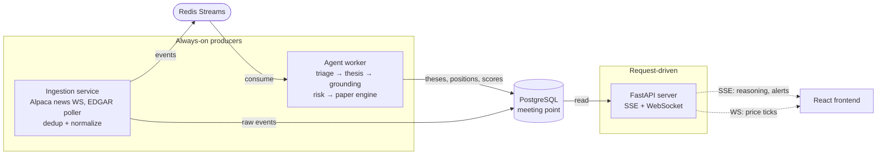

# DESIGN.md — Terminal

Project name: Terminal (working name, easy to rename later). This document is the source of truth for the project's design: vision, principles, stack, architecture, data sources, conventions, and build order.

---

## 1. What this is

A personal, AI-native trading research terminal. A dark, data-dense dashboard that watches the market and news all day. When something material happens, a free AI reads it, researches the affected stock with real data, and writes a structured trading thesis (direction, options play, risk). It works both on demand (manual copilot) and autonomously in the background. It never touches real money: it paper-trades through a self-built simulator. Every thesis is logged and scored so we can measure whether the AI is actually any good.

It is two products sharing infrastructure:
- A research terminal + manual copilot (high value, lower risk, the guaranteed strong outcome).
- An autonomous paper-trading agent (flashier, higher risk, uncertain payoff, built second). **Not a bonus:** without unsupervised theses, the eval harness only scores what we prompted, which is biased. The autonomous agent is the proof point that the evaluation methodology works.

Both products' theses flow through the same eval harness. The manual copilot starts accumulating evaluation data in Phase 4; the autonomous agent adds the unsupervised data from Phase 7.

---

## 2. Core principles (read these before making any design call)

1. **Free forever. No exceptions.** Every dependency must be free, with no credit card and no SSN. No funded brokerage accounts. If a feature requires paid data, we cut the feature, not the budget.
2. **Paper only. Never real money.** The agent simulates trades. A permanent human-in-the-loop approval gate is required before any hypothetical future real-money mode. Do not build live order execution.
3. **Start lean. Earn complexity.** Prefer the simplest tool that works for the actual load. Every heavy technology must be justified by real need, not resume value. See section 6 for what NOT to reach for early.
4. **Resilience is a feature.** Every data source is a free tier with no SLA, and one (yfinance) is unofficial and breaks. Build for graceful degradation from the start. Partial data is the normal case.
5. **Evaluate, don't trust.** Never gate trade execution on an LLM's self-reported confidence (it is uncalibrated). Use deterministic rules for execution decisions. Measure the AI's quality with the eval harness. This rigor is the project's crown jewel.
6. **Success is the system and the evaluation, not the P&L.** The agent's paper returns will likely be near random, because free-data latency caps any real edge. That is fine and expected. Judge the project by whether it is finished and honestly measured, never by the equity curve.
7. **Config-driven.** Model choice, confidence thresholds, the ticker universe, and rate limits live in config, not code.

---

## 3. Tech stack

Start with the "v1" column. Move to "later" only when the listed trigger is actually met.

| Concern | v1 (build with this) | Later (earn it) | Trigger to upgrade |
|---|---|---|---|
| Backend | Python + FastAPI | — | — |
| Python tooling | uv + ruff + mypy + pytest | — | — |
| Agent orchestration | Plain tool-calling loop | LangGraph | When adding the human-in-the-loop approval + reasoning stream |
| Event bus | Redis Streams | Redpanda (Kafka API) | Only if event volume genuinely demands it (it won't soon: ~130 news/day) |
| Database | Plain PostgreSQL + Alembic migrations | + TimescaleDB, + pgvector | Timescale when stored quote volume is large; pgvector when building thesis-memory retrieval (so the agent can recall "last time NVDA reported, this is what I said and what happened") |
| Durable workflows | Idempotent workers + Postgres state + process manager | Temporal | Only if restart-survival via Postgres proves insufficient |
| Cache / hot state | Redis | — | — |
| Frontend | React + TypeScript + Vite + vitest | — | — |
| UI libs | Tailwind + shadcn/ui, lightweight-charts (candles), TanStack Table virtualized (options chain), Recharts or visx (payoff diagrams), TanStack Query, Zustand | — | — |
| Realtime to browser | SSE for agent reasoning + alerts; WebSocket for live price ticks | — | — |
| LLM | Gemini Flash (2.5 or 3, free) **+ Claude Haiku 4.5 (free tier)** — both behind a `LLMProvider` interface from day 1 | Local Ollama (Llama 3 / Qwen 2.5) as quota-exhaustion fallback | Swap via config; never hardcode a model. The dual-cloud setup proves the interface; document the local-LLM swap even before implementing it |
| Observability | Structured logging (JSON, correlation IDs) + Langfuse (LLM traces, cost, latency) | — | — |
| Notifications | Discord bot | PWA + web-push | After core is done. No native mobile app |
| Deployment | Run locally on dev Mac via docker-compose | Self-hosted 24/7 on an old laptop (Linux + Docker + free tunnel); ~$5/mo VPS as paid fallback | Move to the laptop when true 24/7 is wanted. See section 11. No Kubernetes |
| CI | GitHub Actions (lint + typecheck + test on every push) | — | — |

Use only two languages: Python (backend, agent, analytics) and TypeScript (frontend). Do not add a third language for an ingestion service.

---

## 4. Architecture



Three logical processes that meet only at the database. They never call each other directly.

**Always-on producers (run forever, independent of any browser):**
- Ingestion service: holds the long-lived connections (Alpaca news websocket, EDGAR/RSS pollers), normalizes events, publishes to the Redis Streams event bus. Owns reconnection and dedup.
- Agent worker: consumes the event stream, runs the decision funnel, writes results to Postgres. Also runs scheduled jobs (catalyst calendar, mark-to-market/reconciliation).

**Request-driven consumer:**
- FastAPI server: reads from Postgres to serve the React frontend, streams agent reasoning + alerts over SSE, streams live price ticks over WebSocket.

**Meeting point:**
- PostgreSQL. Producers write, the server reads. This decoupling is what keeps the system from becoming spaghetti.

### The agent decision funnel (inside the agent worker)

1. **Ingest, universe-wide.** Alpaca news (Benzinga, wildcard `*`) + EDGAR 8-Ks + the flag scanner's breakouts. Not limited to a watchlist.
2. **Dedup.** Collapse near-duplicate copies of the same story (cheap; hashing or embeddings).
3. **Triage (Gemini Flash).** "Is this material? pass or drop." Cheap gate; most events drop here. Volume (~130 news/day) is small enough to triage everything within the free quota, so the watchlist is NOT a discovery gate (it is only UI prioritization).
4. **Thesis (Gemini Flash + research tools).** Calls tools to gather real data, then emits a structured thesis object (direction, reasoning, suggested contract, max risk, what-must-happen, confidence).
5. **Grounding check.** Verify every number the model cited against the data actually fetched. Reject or flag invented figures.
6. **Risk + sizing (deterministic code, no LLM).** Position size, exposure limits, guardrails (kill switch, max trades/day, max position, circuit breakers).
7. **Paper engine (deterministic).** Simulate the fill, update positions, write everything to Postgres.

The LLM touches only steps 3 and 4. Every consequential decision after the thesis is plain, auditable code.

### Performance budget for the funnel

End-to-end (event arrival → thesis written to DB):
- **Catalyst path** (scheduled, pre-positioned): target under ~60 seconds. We know the event is coming; latency is in our hands.
- **Reactive path** (news arrives unscheduled): target under ~5 minutes. Bounded by triage + tool latency. We are already latency-disadvantaged vs paid feeds; don't over-optimize here, but don't let it drift to 15+ minutes either.

Log end-to-end latency on every thesis from day 1. Without a target you won't notice when you're missing moves.

---

## 5. Data sources (all free, no SSN)

Sources serve three distinct roles. Wire every one behind the data-access abstraction layer (section 7) so any source can be swapped or fall back without touching the rest of the system.

**Discovery feeds (always-on streams that wake the agent):**
- Alpaca News API (Benzinga), subscribed with wildcard `*`. Real-time websocket, ~130 articles/day, each tagged with affected symbols. Primary discovery source.
- SEC EDGAR. 8-K filing stream from every public company, no account. Catches obscure catalysts Benzinga curation skips.
- Own flag scanner. Surfaces price-structure breakouts over a defined liquid universe. Context/discovery only, never an autonomous trigger on its own.

**Research tools (on-demand functions the thesis model calls):**
- Alpaca: price history and option chains. **Primary options source** (free Basic plan includes options via the Indicative Pricing Feed, historical options since 2016 at 15-min delay).
- yfinance: backup for options, plus fundamentals and historical OHLC. Unofficial, breaks periodically. Never put it in a hot path without a fallback.
- SEC EDGAR: filing text (10-K, 10-Q, Form 4 insider transactions, 13F institutional holdings). Use the edgartools library.
- Finnhub (free tier): analyst ratings, price targets, earnings calendar, earnings surprises. ~60 calls/min.
- FRED (free): macro context (rates, CPI, unemployment) for macro-aware theses.
- Web search: qualitative fallback only. Structured data beats web search for accuracy; prefer the sources above.

**Live prices (watchlist sidebar + position marking):**
- Alpaca IEX websocket. Real-time, free with paper account.

### Known free-tier limits (design around these, do not fight them)
- Alpaca equities (Basic): real-time market coverage is IEX only (~2% of volume), websocket 30 symbols, historical 200 calls/min, historical data delayed by 15 min.
- Alpaca options (Basic): Indicative Pricing Feed (an approximation, not the consolidated OPRA feed), websocket 200 option quotes, historical since 2016 at 15-min delay, 200 calls/min.
- Gemini Flash (free): ~1,500 requests/day, 10 RPM. Tightening trend in 2026 — design as if it could shrink further. The triage gate + dedup keep usage well under this.
- Claude Haiku 4.5 (free tier): rate-limited but generous; serves as the second cloud LLM behind the interface.
- Finnhub (free): ~60 calls/min, advanced endpoints are premium.
- There is no free consolidated (SIP) real-time stock data and no free real-time OPRA options data. This is permanent. Accept the delay; it is fine for a paper/learning project.

### Fallbacks (explicit Plan B per source)

Every primary source has a documented fallback. When a circuit breaker opens on the primary, the data layer routes to the fallback automatically (config-flag flip, not runtime negotiation).

| Primary | Fallback | Note |
|---|---|---|
| Alpaca news (Benzinga WS) | RSS (PR Newswire, BusinessWire) + EDGAR 8-K stream | Slower and noisier; lose Benzinga curation but cover same surface |
| Alpaca prices | yfinance → Polygon.io free (5 req/min, EOD) → stooq | Cascading; each step lower fidelity |
| Alpaca options | yfinance options chain | Accept reduced coverage; options without Alpaca is rough |
| yfinance fundamentals | SEC EDGAR XBRL via edgartools | Slower, less complete, but stable |
| yfinance OHLC | stooq, Alpaca historical, Polygon.io | Several paths |
| Finnhub (analyst, earnings cal) | SEC Form 4 + EDGAR earnings text + public Fed calendar | Lose analyst consensus; calendar derivable |
| FRED (macro) | Treasury Direct + BLS public CSVs | Manual integration but bullet-proof |
| Gemini Flash | Claude Haiku 4.5 (already wired) → local Ollama (Llama 3 / Qwen 2.5 small) | Local only for last-resort triage; thesis quality drops, log loudly |

---

## 6. What NOT to do

- Do not reach for Kafka/Redpanda, Temporal, TimescaleDB, pgvector, or Kubernetes in early phases. Use the v1 stack. (See section 3 triggers.)
- Do not build live/real-money order execution. Paper engine only.
- Do not gate execution on LLM self-reported confidence.
- Do not build a backtesting engine for the LLM's predictions. It is contaminated by training data (the model has seen the future of any historical event). The agent is evaluated forward, by live track record, via the eval harness.
- Do not require any paid account, credit card, or SSN for any feature.
- Do not commit secrets. Keep API keys in a project-scoped `.env` (gitignored), loaded by the app only. Do not export keys globally in the shell.
- Do not add crypto, a native mobile app, or human thesis-rating. These were deliberately cut.
- Do not let a failed tool call crash the pipeline; degrade gracefully and note the gap in the thesis.
- Do not let Phase 6+ (autonomous agent) start before Phase 1–5 are demo-ready (see section 9 demo gate). The manual copilot is the guaranteed strong outcome; protect it from autonomous-agent scope creep.

---

## 7. Coding conventions

- **Data-access abstraction layer.** Every external source sits behind a clean interface (e.g. `PriceProvider`, `OptionsProvider`, `NewsProvider`, `FilingsProvider`). Swapping a source or adding a fallback must not touch callers.
- **Caching with TTLs** over all research tools. Do not re-pull the same ticker's filings or fundamentals repeatedly within a short window. Protects quotas and latency.
- **Rate-limiter + circuit-breaker** around each external API. We live inside free quotas.
- **Graceful degradation.** Tool failures return a typed "unavailable" result the thesis model can reason around, never an exception that kills the run.
- **Config-driven** (section 2.7). A single config module/file holds: active model per step, confidence thresholds, ticker universe, rate limits, guardrail limits, feature flags.
- **Structured logging** everywhere (JSON), with correlation IDs per event so a thesis can be traced end to end.
- **Typed thesis object.** Use Pydantic models for the thesis and all structured LLM outputs. Instruct the model to return JSON matching the schema; parse and validate.
- **Market-hours awareness.** Don't generate equity theses at 3am Sunday; respect session times.
- **Clean module boundaries** matching the architecture (ingestion, agent, engine, eval, data, llm, api).
- **Containerize as you go.** Each service gets a Dockerfile when it is built, and the whole stack is wired into `docker-compose.yml` from early on. This is what makes "run on the Mac," "run on the laptop," and "run on a VPS" the same command pointed at different machines. Do not leave Docker as a final-step retrofit.
- **Tests from day 1.** pytest for backend, vitest for frontend. Every interface gets a contract test. Every pure-math function (Brier scoring, payoff math) gets unit tests with known answers. Every data provider gets integration tests against recorded fixtures (VCR-style). Aim for tests that verify behavior, not coverage percent.
- **CI on every push.** GitHub Actions: ruff + mypy + pytest for backend, tsc + prettier + vitest for frontend. Free for public repos. If CI is red, fix or revert; do not accumulate broken-main debt.
- **Architecture Decision Records.** Major design choices get an ADR in `docs/decisions/ADR-NNNN-*.md`. Target ~5 well-written ADRs by project end; they are a substantial portfolio deliverable.
- **Disclaimer in README.** This is a paper-trading research project. The README leads with a clear note: no real money, not investment advice, free-tier data is delayed. Protect future-you from anyone reading too much into it.

### Suggested repo layout
```
/backend
  /app
    /api        routes, SSE, WebSocket
    /core       config, logging, correlation
    /data       interfaces, providers, cache, rate-limit, circuit-breaker
    /llm        LLM provider interfaces (Gemini, Anthropic; Ollama later)
    /agent      thesis funnel: tools, grounding, copilot orchestrator, schemas
    /discovery  ingestion: event bus, EDGAR poller, triage, reactive runner
    /portfolio  paper engine, risk engine, account seed, ORM models
    /eval       evaluation harness (scoring, persistence, models)
  /alembic      database migrations
  /tests
/frontend
  /src          components, pages, lib, hooks
  /__tests__
/.claude/       custom agents, slash commands, hooks (visible — part of the story)
/.github/workflows/  CI
/docs
  /decisions/   ADRs
  demo.md       walkthrough for the recorded demo
.env.example
docker-compose.yml
DESIGN.md
```

---

## 8. Key components beyond the funnel

- **Manual copilot.** Type a thesis ("NVDA drops after earnings, I have $500 to risk"); the same reasoning engine researches it and returns a specific recommendation: contract, cost, max loss, probability framing, payoff diagram, plain-English explanation. Build this first; it is the learning tool and the guaranteed strong outcome.
- **Eval harness.** Log every thesis (reasoning, predicted direction, confidence) and later its outcome. Score hit rate and calibration (Brier score). Forward-testing only. Wire it in as soon as theses exist so it accumulates data.
  - **Score sources separately.** Manual-copilot theses, autonomous reactive theses, and autonomous catalyst-driven theses are three different distributions. Score them in three buckets, not one. Catalyst-driven theses may have measurable edge (deterministic timing); reactive theses almost certainly won't. Mixing them hides the truth.
  - **Calibration plot per bucket.** A graph of stated confidence vs realized hit rate — the most resume-impressive single artifact in the project.
- **Paper engine.** Self-built. Fills against live quotes (mid price, or a small spread haircut for realism). Models options expiration and assignment. Runs two accounts: conservative (high threshold, smaller, safer) and aggressive (lower threshold, bigger, shorter-dated). The conservative/aggressive contrast IS the feature: it tests whether LLM confidence translates to position-sizing edge. A scheduled mark-to-market/reconciliation job revalues open positions and handles expirations, or the P&L silently lies.
- **Shadow mode.** Before the autonomous agent places any paper trade, it runs in shadow: generates full theses and logs what it would have traded, committing nothing. **Explicit go/no-go criteria before graduating to paper trades:** at least 50 shadow theses logged AND grounding-check pass rate ≥ 95% AND Brier score on the shadow set no worse than the all-50/50 baseline (0.25). Below any of these: fix and re-shadow.
- **Catalyst calendar.** Scheduler of known events (earnings, Fed, FDA dates) so the agent pre-positions rather than only reacting. Earnings dates from Finnhub/yfinance; Fed/economic calendars are public.
- **Discord bot.** Formatted phone alerts when a thesis is generated or a paper trade is placed (ticker, price, what happened, thesis summary, suggested trade, confidence, link to the app).
- **Own MCP server (later flex).** Expose the system (paper engine, thesis history, scanner) as MCP tools so it can be queried from Claude Desktop. Build after the core works.

---

## 9. Build order (phases)

1. **Foundation.** Repo structure, config system, data-access abstraction (interfaces + stubs), `.env` handling, structured logging with correlation IDs, FastAPI skeleton, React/Vite skeleton, health checks. **Plus:** pytest + vitest + CI workflow + pre-commit (ruff format + gitleaks) + Alembic init + eval-harness DB schema and scoring functions + dual-LLM stubs (Gemini + Claude Haiku) + ADR-0001. Backend runs, frontend loads, all checks green.
2. **Data layer + resilience.** Implement sources behind the interfaces (Alpaca, EDGAR, Finnhub, FRED, yfinance fallback), with caching, rate-limiting, circuit breakers, graceful degradation. Watchlist sidebar with live IEX prices.
3. **Pure-math features (no AI).** Payoff diagrams, options chain viewer, ticker deep-dive page.
4. **Manual copilot.** Tool-calling loop + Gemini Flash + grounding check + typed thesis. First real AI product. Manual-copilot theses flow through the eval harness from this phase forward.
5. **Eval harness (full).** Calibration plots, per-bucket scoring, dashboard. The harness was scaffolded in Phase 1; this phase makes it the visible artifact.

**Demo gate.** Before starting Phase 6: record a screen-capture demo of the manual copilot (~90 seconds), populate `docs/demo.md` with the walkthrough, take dashboard screenshots, write a first "what I learned" pass on the README. Phases 1–5 are the guaranteed-strong portfolio piece; this gate ensures it ships polished even if Phases 6–8 stall.

6. **Discovery pipeline.** Ingestion service (always-on), Redis Streams bus, dedup, Flash triage. Add replay mode (consume from stored event log for offline debugging) and a synthetic-event injector for development.
7. **Autonomous agent.** Shadow mode first, then paper trades. Risk/guardrail layer, paper engine, two accounts (conservative + aggressive), reconciliation job, catalyst calendar.
8. **Notifications + earned upgrades.** Discord bot. Then, only as earned: MCP server, PWA, LangGraph approval flow, Timescale/pgvector (when thesis-memory retrieval is built), and (rarely) Redpanda/Temporal.

Finish phases 1 to 5 (including the demo gate) before depending on anything in 6 to 8. A complete copilot + eval harness is already a strong, finished portfolio project on its own.

---

## 10. Tech facts to verify, not assume

- Free-tier limits and model availability change. Re-check Alpaca, Gemini, Claude, Finnhub limits when relevant rather than trusting stale numbers. Gemini Pro was tightened in April 2026; Flash remains free but the trend is restrictive.
- Confirm the exact shape of Alpaca's indicative options feed and Greeks availability when building the options viewer; compute Greeks locally (py_vollib) if not provided.
- yfinance breakage is a when, not an if. The fallback path must exist before it is relied on.

---

## 11. Hosting and deployment

This is not one app. It is several long-running processes (ingestion service, agent worker, FastAPI server) plus Postgres and Redis. Request-driven serverless hosts (Vercel and similar) do not fit, because the agent must run continuously. The deployment artifact is always the same: a `docker-compose.yml` defining every service. Because of that, moving between machines is just pointing the same command at a different host.

**Phase A: during the build (now).** Everything runs locally on the dev Mac via docker-compose. No external hosting. This is the default for all of development.

**Phase B: 24/7 on the old laptop (the target).** When continuous operation is wanted, repurpose the spare laptop as a small home server:
- Wipe it and install a Linux server distro (e.g. Ubuntu Server).
- Install Docker and run the same docker-compose stack. Set it to restart on boot.
- Expose the dashboard securely with a free tunnel, NOT by opening router ports. Use Cloudflare Tunnel (for a public URL) or Tailscale (for private access from your own devices). Both are free.
- **Auth on public exposure.** When using Cloudflare Tunnel for a public URL, put it behind Cloudflare Access (free for up to 50 users) — single Google login, no extra infra. Tailscale-only access needs no extra auth.
- **Back up the eval data.** Nightly `pg_dump` to cloud storage (Backblaze B2 free 10 GB, or rclone to Google Drive). The eval data is the accumulating value of this project; lose it and Phase 5 onward is set back.
- Accept the tradeoffs: the laptop must stay powered and online; a power or internet blip takes the agent offline until it returns. Survivable for a personal project. Idempotent workers + Postgres state (section 3) mean it recovers cleanly on restart.

**Fallback: ~$5/mo VPS.** If the laptop proves unreliable or you want the system off your home internet, deploy the identical docker-compose stack to a small Hetzner or DigitalOcean box. Breaks the strict free rule, but at coffee-money scale, and gives real uptime and a public address.

**Avoid for the always-on parts:** free cloud tiers (Railway, Fly.io). Persistent workers plus a live database burn free credits fast because nothing ever sleeps, so you end up paying anyway, at which point a plain VPS is cheaper and simpler.

Recommendation: develop on the Mac, go to the laptop with a tunnel for 24/7, keep the VPS as the fallback. Containerizing as you go (section 7) is what keeps all three interchangeable.
